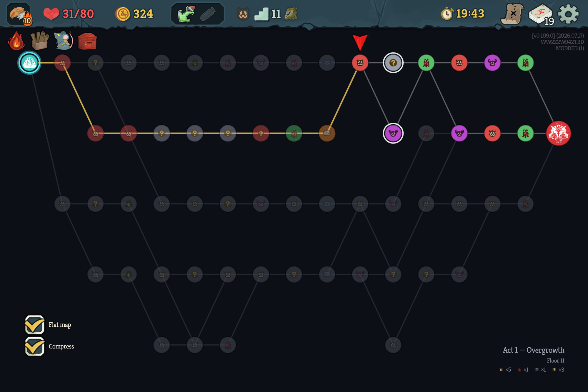
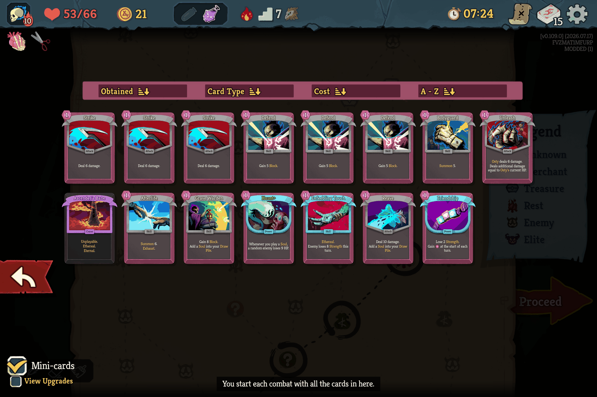

# DeckView — zoomed-out deck and map views for Slay the Spire 2

DeckView zooms out deck-like screens and provides a clearer, optional whole-act map laid out
left-to-right. It changes visibility and UI layout only: **it does not alter cards, routes,
travel rules, saves, combat, rewards, or any other gameplay.**

| Flat map page | Mini-cards deck view |
|---|---|
|  |  |

> **Built and tested for Slay the Spire 2 `v0.109.0`.**
>
> DeckView checks every game hook before enabling. If an STS2 update moves an internal member,
> DeckView logs the missing hooks, disables itself, and leaves the vanilla UI running. Harmony
> setup is rolled back if patching fails, so the mod never intentionally leaves a half-patched UI.

## What it's for

STS2 draws deck-like views at a size where only a handful of cards fit on screen, so you
scroll a lot and can't take your deck in at a glance. DeckView shrinks those cards so more
of the deck fits at once and the whole thing is easier to read. Cards stay small until you
mouse over one, which pops it to full size; move off and it shrinks back.

- **Shrinks:** the deck view, the draw / discard / exhaust piles, the card library, and the
  deck card-select screens.
- **Left at normal size:** the combat hand, the inspect popup, and the choose-a-card,
  card-reward, unlock, shop, and card-bundle screens.
- **Toggle any time:** open a card view and either click the on-screen **Mini-cards** toggle
  (next to *View upgrades*) or press **T**. The choice is saved and persists across runs
  (`user://deckview.cfg`).
- **Flat map:** a from-scratch, whole-act-on-one-screen view of the map, laid out left→right
  and vertically compacted, rendered as a real top-level page (its own top bar, ESC/back,
  controller routing). Every room shows the game's real icon on a color-coded circle; your
  current spot, your legal next moves (relic-aware, incl. Wing Boots), your past route, and the
  rooms you can no longer reach are all called out. Two checkboxes — **Flat map** and
  **Compress** — configure how it looks; **M** (from anywhere) opens/closes the map in that
  configured style, **O** flips flat↔classic while the map is up. It only ever *reads* the live
  map — it never changes your run.

It's a Godot + C# + Harmony rewrite of the original STS1 DeckView mod (Java + ModTheSpire),
built on STS2's own mod loader — nothing from the game is bundled.

## How it works

STS2's card grid (`NCardGrid`) is already responsive — the column count, row count and
scroll bounds are all computed from the per-card layout size (`_cardSize`) and
`CardPadding`. So the mod just makes the cards smaller and everything reflows to fit
more per screen. Two coordinated Harmony patches keep layout and rendering in sync:

| Patch | Target | Effect |
|-------|--------|--------|
| Postfix | `NCardGrid.ConnectSignals` (`_cardSize`) | shrinks the layout cell → more columns/rows, tighter scroll |
| Postfix | `NCardHolder.SmallScale` getter, guarded to `NGridCardHolder` | shrinks the *rendered* grid card to match |
| Postfix | `NCardGrid.CardPadding` getter | tighter spacing between cards |
| Postfix | `NCardGrid._Process` | each frame, snap any enlarged card the mouse isn't really over back to small (and dismiss its hover-tip / related-card popup) |
| Postfix | `NGridCardHolder.Create` | clear stale `_isHovered`/`_isFocused` on pooled reuse |

### Why the hover reconcile (the "one card opens too big" fix)

Open the deck view and one card sometimes shows at full size while the rest are shrunk. It
isn't under the mouse — it's the card that *would* have been under the cursor at vanilla
card size. Cause: while the grid lays out / animates in, a card's hitbox briefly passes
under the (stationary) mouse, so Godot fires `MouseEntered` and the card pops to
`HoverScale`. The card then settles into its small position away from the cursor, but Godot
does **not** fire `MouseExited` for a control that moves out from under a stationary mouse,
so the hitbox's `_isHovered` stays `true` and nothing shrinks it back. (Trusting
`_isHovered` can't fix this — it *is* the stale value.)

So each frame the grid processes, the mod reconciles against ground truth: for any card
that's currently enlarged, if the mouse isn't actually inside the card's real (scaled)
on-screen rect, it clears the stale hitbox `_isHovered` bit (the root cause) and then drives
the game's **own** un-hover path — `RefreshFocusState()` → `DoCardHoverEffects(false)` — rather
than hand-rolling the shrink. That matters for the popup: the game only dismisses a card's
hover tip inside `DoCardHoverEffects(false)` (via `ClearHoverTips()` → `NHoverTipSet.Remove`),
which frees the *one* tip set that holds both the keyword tips and the related-card previews.
Driving the real path makes our dismissal byte-for-byte identical to vanilla, so the popup no
longer lingers after a card shrinks; the normal smooth shrink tween runs too. A genuine
mouse-over still pops a card to full size (the game's own `MouseEntered` path); only the
stuck/stale case is corrected. This also covers the deck view grab-focusing a default card on
open. The reconcile is skipped while a controller is in use, so controller focus still
enlarges the focused card; the `Create` reset does a lightweight flag scrub on pooled holders
(no tween, since a freshly-created holder may not be in the tree yet).

### Mini / large toggle (persistent)

Every shrink patch is gated on a single mode flag (`DeckModeController.MiniEnabled`), loaded
from and saved to `user://deckview.cfg`, so your choice survives across runs (default: mini).
Flip it two ways, both routed through `DeckModeController.SetMini` so they stay in agreement:
the **T** hotkey, or an on-screen **Mini-cards** tickbox. The tickbox is a self-drawn
`ToggleSwitch` using the game's own checkbox art (`ui_atlas.sprites/checkbox_*`) and Kreon font,
sized to match the adjacent *View upgrades* control (cloning the game's `NTickbox` via
`Node.Duplicate` was tried first but NRE'd — its `%TickboxVisuals` scene-unique names are owned
by the screen). It's wired to `SetMini` and seeded to the current mode when the screen connects.
Because the layout cell size (`_cardSize`)
is only computed once in `ConnectSignals`, a live toggle can't just change the render scale — it
would leave columns/scroll out of sync. So the mod records each grid's vanilla base size at
connect time and, on toggle, rewrites `_cardSize` from that (× the mode factor) and flags the
grid for reinit; the grid then rebuilds (`InitGrid`) with size, padding, and rendered scale all
in agreement — a clean, complete swap with no half-state.

(The hotkey is *read* each frame, not consumed — so if it were also bound to something on that
screen, both would happen; it can't break the other function. `T` isn't a known deck-screen
binding. Change `ToggleDeckModeKey` in `DeckViewMod.cs` if it clashes. The tickbox's exact
placement follows the live *View upgrades* control, and it measures that control so its checkbox
and label sizing match.)

### Flat map

The flat map is a real **capstone screen** (`MiniMapScreen : ICapstoneScreen`, opened via
`NCapstoneContainer`), exactly like the game's own deck-view screen — so it's a top-level page
that keeps the top bar, dim backstop, combat pause, and native focus/ESC/controller routing.
(An earlier "zoom the real map out" attempt couldn't work — `NMapScreen._Process` rewrites the
map container's position every frame and there's no zoom field — and an overlay `Control` isn't
recognized as the current screen; the capstone route is the clean one. Note also that Godot's
source generators don't run for this mod, so `_Draw`/`_GuiInput` overrides never fire — the page
draws via the `Draw` **signal** and takes input via the `gui_input` **signal**.)

It reads live state straight off `NMapScreen` — each point's coord, `MapPointType`, travel
`State`, the real room-icon texture, edges (`MapPoint.Children`), plus the run's
`CurrentMapCoord`, act, and `IsTravelEnabled` — and never mutates any of it. Layout runs the
act's graph through a pure compaction pass (see below) and draws each room as a color-coded
circle with the game's own icon on top, floors along X and the compacted lane along Y.

Node states are all called out at a glance: your **current** spot (blue ring + the game's own
"you are here" arrow); your **legal next moves** (bright halos — but only once the current room
is finished, and using the game's own relic-aware travelable set so **Wing Boots** correctly
lights up the whole next row); your **past route** (kept in color but dimmed, and a visited `?`
adopts the room it turned out to be); and rooms you **can no longer reach** (greyed, edges
faded). Click a highlighted room to travel there via the game's own selection path.

**Compaction (the interesting part).** The whole act is squeezed onto one screen without ever
changing which rooms connect. The key invariant: every step preserves each floor's *column
order*, so the crossing count is identical to the game's — compaction can only reassign display
lanes, never scramble connectivity or overlap two rooms. It's proven offline in `layout/`: a
pure `MapLayout` algorithm + an invariant checker + metrics + a 500-map property test + captured
real levels + an ASCII viz tool. Typical result: ~27% fewer lanes, ~28% shorter edges, 0
crossings added. The **Compress** checkbox shows compacted (on) vs. raw 1:1 with the game's
columns (off), so you can see the compaction changed nothing but spacing.

**Keys / state.** The two checkboxes (**Flat map**, **Compress**) are the single source of truth
for how the map looks and are saved across runs. **M** is the one global shortcut — from any
screen it toggles the map's visibility, opening it in the configured style; ESC/back and M both
leave the *whole* map back to the prior view (the flat page is never a sub-layer you fall back
from). **O** works only while a map is up, flipping flat↔classic in place.

Tunables are constants at the top of `DeckViewMod.cs`:

- `CardScaleFactor` (default `0.6`) — 0.6 ≈ the STS1 mod's "60% of vanilla" look. Lower = smaller.
- `CardPadding` (default `24`) — vanilla is `40`. Set to `40` to keep vanilla spacing.
- `ToggleDeckModeKey` (default `T`) — the mini/large card toggle key.
- `ToggleMiniMapKey` (default `O`) — flips flat↔classic while a map is open.
- `MapKey` (default `M`) — the global open/close-the-map shortcut.

## Requirements

- Slay the Spire 2 `v0.109.0`.
- No gameplay dependencies. DeckView uses the game's built-in mod loader.

## Install

Download the latest `deckview-…zip` from
[GitHub Releases](https://github.com/ernop/sts2-deckview/releases), then extract it into the
game's `mods` directory. The result should be:

```text
Slay the Spire 2/
└── mods/
    └── deckview/
        ├── deckview.dll
        └── manifest.json
```

Launch STS2, enable DeckView in the **Mods** menu, and restart when prompted.

## Build from source

Building requires the .NET 9 SDK and an installed copy of STS2. The project references the
game-provided `sts2.dll`, `GodotSharp.dll`, and `0Harmony.dll`; none are bundled.

```powershell
# from the repo root, on Windows:
.\scripts\build.ps1 -Install
```

Or manually: `dotnet build deckview.csproj -c Release -o bin`, then copy `bin\deckview.dll`
and `manifest.json` into `…\Slay the Spire 2\mods\deckview\`.

A/B check: launch with `--nomods` to see vanilla for comparison.

See [`DEVELOPMENT.md`](DEVELOPMENT.md) for the full dev setup — how to decompile the game
(`ilspycmd`), the exact toolchain paths (WSL drives the Windows dotnet SDK), the map data model,
compatibility preflight, and release checks.

## Status / caveats

- Built and tested for STS2 `v0.109.0`; `TestedGameVersion` in code and `min_game_version` in the
  manifest record that compatibility target.
- Mouse, keyboard, and controller can activate every DeckView checkbox. On the flat map,
  controller focus starts on a legal destination; directional input moves between destinations
  and accept travels there. The classic map links its default focus to the **Flat map** checkbox.
- DeckView uses private game members, so every STS2 update still requires verification.
  `scripts/verify-hooks.sh` and the in-game preflight maintain the complete hook inventory.
  Missing hooks disable DeckView cleanly and preserve vanilla behavior.
- Full build and in-game checks require an installed copy of STS2 and cannot run in public CI.
- To support a newer game build: rebuild against its `sts2.dll`, then bump `TestedGameVersion`
  and `manifest.json`'s `min_game_version` / name to that version.

## License

DeckView is available under the [MIT License](LICENSE). Slay the Spire 2 and its assets are
owned by Mega Crit; no game assemblies or assets are distributed with this project.
